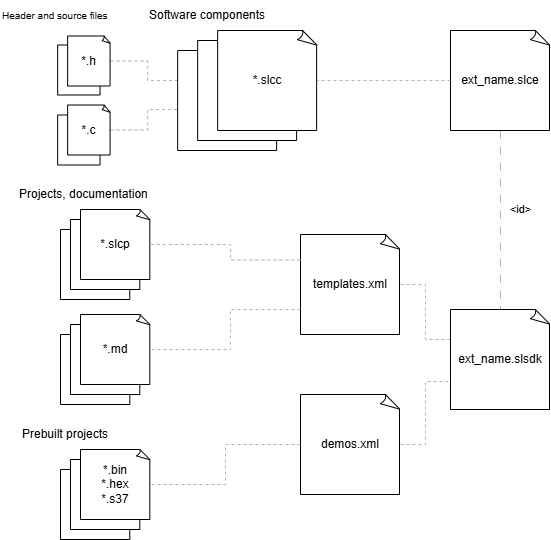

# Creating SDK Extensions

This section discusses what constitutes an SDK extension and how to create one, as well as collating any information from the primary specification that pertains to SDK extensions. Note that this document is updated separately from the specification. In the event that the specification and this document do not align, the specification supersedes this document.

## Overview




The SDK extensions can provide software components, template applications and demo applications.


### SLC metafiles

 - ***.slce**

   The .slce file sits at the root of an SDK extension. It behaves similarly to the .slcs file in an SDK, and contains a list of paths to search for components.

 - ***.slcc**

   The .slcc file describes a single SLC component, with references to the different files that make up the component.

 - ***.slcp**

    The SLC project is described in a .slcp file. The project file contains references to the SDK and any SDK extensions used, and a list of components to use from these.

 - ***.slsdk**

    Studio Extension descriptor file. This file provides the paths for the templates.xml and demos.xml file and it is required for the Studio to show the template applications and demos in the Launcher view. 

 - **templates.xml**

    This file lists all of your \*.slcp files and gathers all the meta data about them including the documentation to provide to Simplicity Studio.

 - **demos.xml**

    This file lists all of your pre-built projects (*.bin, *.hex, *.s37 format) and gathers all the meta data about them to provide to Simplicity Studio.

### SLC Specification

More details and the available properties for the SLC metafiles are described in the SLC Specification [here](https://siliconlabs.github.io/slc-specification/).


### Software tools and documentation


### Recommended folder structure

 - **applications**
   - application_a
     - inc
     - src
     - config
     - application_a.slcp
     - README.md
   - application_b
     - inc
     - src
     - config
     - application_b.slcp
     - README.md
 - **components**
   - component_a.slcc
   - component_b.slcc
   - component_a
     - inc
     - src
     - doc
     - config
   - component_b
     - inc
     - src
     - doc
     - config
- **demos**
  - demo_a
    - demo_a.s37
  - demo_b
    - demo_b.s37
- your_extension.slce
- your_extension.slsdk
- templates.xml
- demos.xml

```inc``` folders are only allowed to contain header files.\
```src``` folders are only allowed to contain \*.c source files.\
```config``` folders are for [configuration files](https://siliconlabs.github.io/slc-specification/1.2/format/component/config_file/) for components or projects.\
```doc``` folders are for documentation, \*.txt or \*.md can be placed here and all other content needed by these files.\