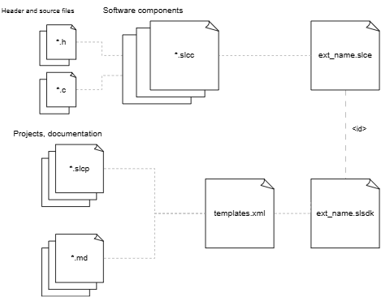

# SDK Extensions

This section discusses what constitutes an SDK extension and how to create one, as well as collating any information from the primary specification that pertains to SDK extensions. Note that this document is updated separately from the specification. In the event that the specification and this document do not align, the specification supersedes this document.

This tutorial guides you through the process of contributing to Silicon Labs SiSDK as a SiSDK Extension with the following main steps:

1.  How to create a SiSDK Extension with the necessary metafiles with SLC CLI
2.  Case study about how to componentize a self-contained software functionality to be reusable (.slcc) with SLC CLI
3.  Case study about how to create a Sample Application (.slcp) with SLC CLI
    1.  Re-use a component (.slcc) in your Sample Application with SLC CLI
    2.  Generate/build/flash the Sample Application with SLC CLI and Simplicity Commander 
4.  How to use/validate finally the new SiSDK Extension with Simplicity Studio
5.  Including: best practices, hints, validation guides etc.

The source code for this extension created in this tutorial is available on GitHub [here](https://github.com/SiliconLabsSoftware/docs-simplicity-extensions/example_extension).

## Overview



### SLC metafiles

 - ***.slce**

   The .slce file sits at the root of an SDK extension. It behaves similarly to the .slcs file in an SDK, and contains a list of paths to search for components.

 - ***.slcc**

   The .slcc file describes a single SLC component, with references to the different files that make up the component.

 - ***.slcp**

    The SLC project is described in a .slcp file. The project file contains references to the SDK and any SDK extensions used, and a list of components to use from these.

### Simplicity Studio metafiles

 - ***.slsdk**

    Studio Extension descriptor file. This file provides the paths for the templates.xml and demos.xml file and it is required for the Studio to show the template applications and demos in the Launcher view. 

 - **templates.xml**

    This file lists all of your \*.slcp files and gathers all the meta data about them including the documentation to provide to Simplicity Studio.


#### Recommended folder structure

- **your_extension**
  - **examples**
    - example_a
      - inc
      - src
      - config
      - example_a.slcp
      - README.md
    - example_b
      - inc
      - src
      - config
      - example_b.slcp
      - README.md
  - **components**
    - component_a.slcc
    - component_b.slcc
    - component_a
      - inc
      - src
      - config
    - component_b
      - inc
      - src
      - config
  - your_extension.slce
  - your_extension.slsdk
  - templates.xml

# Software Tools and Documentation for Development

## Documentation

-   [SLC-CLI User's Guide](https://docs.silabs.com/simplicity-studio-5-users-guide/latest/ss-5-users-guide-tools-slc-cli/#slc-cli-user-s-guide) - Generic documentation about SLC CLI cmd line tool, project generation and GSD Extensions. Please read through it carefully!
-   [SLC Specification v1.2](https://siliconlabs.github.io/slc-specification/1.2/) - Metadata specification for Silicon Labs SDKs (v1.2)
-   [UG162: Simplicity Commander Reference Guide](https://www.silabs.com/documents/public/user-guides/ug162-simplicity-commander-reference-guide.pdf)

## Downloads

-   [SiliconLabs/simplicity_sdk/sisdk-2024.6](https://github.com/SiliconLabs/simplicity_sdk/tree/sisdk-2024.6) - SiSDK 2024.6
    - [Getting Started with Simplicity SDK](https://github.com/SiliconLabs/simplicity_sdk/tree/sisdk-2024.6?tab=readme-ov-file#getting-started-with-simplicity-sdk)
    - [Toolchain Support](https://github.com/SiliconLabs/simplicity_sdk/blob/sisdk-2024.6/README.md#toolchain) (Simplicity Studio\'s Installation Manager)
    - [Silicon Labs Configurator (SLC) Command-line Interface (CLI)](https://github.com/SiliconLabs/simplicity_sdk/blob/sisdk-2024.6/README.md#silicon-labs-configurator-slc-command-line-interface-cli)
    - [XML Template Generator Script](https://github.com/SiliconLabsSoftware/docs-simplicity-extensions/tools/template_xml_generator)

# Extension Creation with SLC CLI

To be used as an SDK extension, all you need initially is an .slce file and a folder that contains it. This becomes the container for the SDK extension.
The .slce file sits at the root of an SDK extension. It behaves similarly to the .slcs file in an SDK, and contains a list of paths to search for components.

In this tutorial we are creating an SDK extension for the Silicon Labs Simplicity SDK. The method described here also applies to GSDK or any other Silicon Labs SDKs.

First you will create an empty SDK extension for the sole purpose of testing that the integration of the SDK extension into the SDK is successful. So you can test as you go, you will create an SDK extension such that you do not need to go to the Simplicity Studio UI to install it.

- Name your base folder anything you like.
- Ensure your base folder is in the extension directory of the SDK. If the folder does not exist, create it. By default, it is likely you will not have it if you have yet to install extensions into a particular SDK.
  - Because you will be using the slc cli later to verify your SDK extension is installed properly, make sure you are creating your SDK extension in the same SDK that is configured with slc configuration –-sdk.
  - If you are performing these steps with an sdk you downloaded using the Simplicity Studio installation, you will typically find the sdk in your user home folder. Navigate to SimplicityStudio → SDKs → simplicity_sdk to find your installed sdk. You can also see where you installed the sdk from Simplicity Studio by checking the installation manager. Go to Launcher View, select Install at the top, and select the SDKs tab. Then, find the SiSDK - 32-bit and Wireless MCUs installation card and check the path indicated there.

This is an example folder structure:

- SimplicityStudio
  - SDKs
    - simplicity_sdk
      - extension
        - your_extension

## Extension file (\*.slce) creation

The generic elaboration of creating an .slce can be found in [UG520: Software Project Generation and Configuration with SLC-CLI](https://www.silabs.com/documents/public/user-guides/ug520-software-project-generation-configuration-with-slc-cli.pdf) Chapter 3.6. In this section you will use it for a specific use case.

### Create the Extension folder

For development purpose create the \"extension\" folder, mentioned in the [UG520: Software Project Generation and Configuration with SLC-CLI](https://www.silabs.com/documents/public/user-guides/ug520-software-project-generation-configuration-with-slc-cli.pdf) chapter 3.6.2. Creating the the SiSDK Extension collection folder in your SiSDK repository, if there isn\'t one existing already.
In the extension folder create your extension for example \"example_extension\".

```shell
cd simplicity_sdk #enter to the previously cloned SiSDK folder
mkdir extension
cd extension
mkdir example_extension
cd example_extension
```

### Folder Structure Pattern

The following folder structure is required to be applied to the extension repository.

-   Extension
    -   components
        -   component_A
            -   inc
            -   src
            -   config
    -   examples
        -   example_A
            -   inc
            -   src
            -   config
            -   doc
    -   tests

```inc``` folders are only allowed to contain header files.\
```src``` folders are only allowed to contain \*.c source files.\
```config``` folders are for [configuration files](https://siliconlabs.github.io/slc-specification/1.2/format/component/config_file/) for components or projects.\
```doc``` folders are for documentation, \*.txt or \*.md can be placed here and all other content needed by these files.\
```tests``` folder could contain any testing done for components or projects.

### Create the Extension file

After you have a folder for your extenstion, the next step is to create the Extension file with ```.slce``` type.

```shell
touch my_extension.slce
```

After creating the file you will need to fill it with the following important values. The slce format is based on the YAML file format but it has extra rules. Read more about it in the [documentation](https://siliconlabs.github.io/slc-specification/1.2).

The sample my_extension.slce file:

```yaml
id: my_extension
label: My Extension
description: >
  Tutorial extension for SiSDK Suite
version: 1.0.0
sdk:
  id: simplicity_sdk
  version: 2024.6.2
component_path:
- path: components
```

To understand these parameters read: [Id](https://siliconlabs.github.io/slc-specification/1.2/format/extension/id/), [label](https://siliconlabs.github.io/slc-specification/1.2/format/extension/label/), [description](https://siliconlabs.github.io/slc-specification/1.2/format/extension/description/), [version](https://siliconlabs.github.io/slc-specification/1.2/format/extension/version/), [sdk](https://siliconlabs.github.io/slc-specification/1.2/format/extension/sdk/), [component_path](https://siliconlabs.github.io/slc-specification/1.2/format/extension/component_path/)

> **ⓘ NOTE**: For ```id``` parameter\'s value the best practice is that you have same name for the slce file and for the id.

### Add SiSDK Extension to the SiSDK with SLC CLI

You have created the extension in the SiSDK repository under the extension folder, it is in the SiSDK but the SCL CLI won\'t recognize it yet. To be able to use the extension repository you have to register it as a trusted extension.

The registration can be done by the following command.

``` 
slc signature trust -extpath path/to/SiSDK/extension/example_extension
```
```-extpath``` is used to locate the path to the extension. The extension must be placed under the the SiSDK/extension folder.

## Component file (\*.slcc) creation

At first please read through the brief overview of components (.slcc) at  [SLC Components](https://siliconlabs.github.io/slc-specification/1.2/component-overview/).

You will create in this chapter an universal component with \*.c and \*.h files which will add to any project the function to read the Device Unique ID from CLI.

### Create component

First you have to create the component folder that you have already defined in the slce component_path field.


```shell
cd path/to/example_extension
mkdir components
cd components
```


After creating the folder you will have to create your component file, which is a .slcc type file based on YAML.


```shell
touch sample_component.slcc
```


After creating the file you will need to fill it with the following parameters.


```yaml
id: sample_component_info
label: Sample Component
package: my_extension
description: Sample Component to print info
category: My Extension|My Component
quality: production
root_path: "components/sample_component"

source:
  - path: src/cli_info.c

include:
  - path: inc
    file_list:
      - path: cli_info.h

config_file:
  - path: config/cli_config.h

requires:
  - name: cli

template_contribution:
  - name: cli_command
    value:
      name: info
      handler: cli_info
      help: Print device unique id
  - name: event_handler
    value:
      event: internal_app_init
      include: "cli_info.h"
      handler: "print_sample_app_name"
    priority: 2000
  - name: component_catalog
    value: my_sample_component
```

The sample cli_info.h file:

```C
/***************************************************************************//**
 * @file
 * @brief cli_info.h
 *******************************************************************************
 * # License
 * <b>Copyright 2018 Silicon Laboratories Inc. www.silabs.com</b>
 *******************************************************************************
 *
 * SPDX-License-Identifier: Zlib
 *
 * The licensor of this software is Silicon Laboratories Inc.
 *
 * This software is provided 'as-is', without any express or implied
 * warranty. In no event will the authors be held liable for any damages
 * arising from the use of this software.
 *
 * Permission is granted to anyone to use this software for any purpose,
 * including commercial applications, and to alter it and redistribute it
 * freely, subject to the following restrictions:
 *
 * 1. The origin of this software must not be misrepresented; you must not
 *    claim that you wrote the original software. If you use this software
 *    in a product, an acknowledgment in the product documentation would be
 *    appreciated but is not required.
 * 2. Altered source versions must be plainly marked as such, and must not be
 *    misrepresented as being the original software.
 * 3. This notice may not be removed or altered from any source distribution.
 *
 ******************************************************************************/
#ifndef CLI_INFO_H
#define CLI_INFO_H

// -----------------------------------------------------------------------------
//                                   Includes
// -----------------------------------------------------------------------------
#include "printf.h"
#include "em_chip.h"
#include "sl_cli_instances.h"
#include "sl_cli.h"
#include "cli_config.h"
#include "string.h"

// -----------------------------------------------------------------------------
//                              Macros and Typedefs
// -----------------------------------------------------------------------------

// -----------------------------------------------------------------------------
//                                Global Variables
// -----------------------------------------------------------------------------

// -----------------------------------------------------------------------------
//                          Public Function Declarations
// -----------------------------------------------------------------------------
/******************************************************************************
 * Print sample app name
 *****************************************************************************/
void print_sample_app_name(void);

#endif  // CLI_INFO_H
```

The sample cli_config.h file:

```C
/***************************************************************************//**
 * @file
 * @brief
 *******************************************************************************
 * # License
 * <b>Copyright 2021 Silicon Laboratories Inc. www.silabs.com</b>
 *******************************************************************************
 *
 * SPDX-License-Identifier: Zlib
 *
 * The licensor of this software is Silicon Laboratories Inc.
 *
 * This software is provided 'as-is', without any express or implied
 * warranty. In no event will the authors be held liable for any damages
 * arising from the use of this software.
 *
 * Permission is granted to anyone to use this software for any purpose,
 * including commercial applications, and to alter it and redistribute it
 * freely, subject to the following restrictions:
 *
 * 1. The origin of this software must not be misrepresented; you must not
 *    claim that you wrote the original software. If you use this software
 *    in a product, an acknowledgment in the product documentation would be
 *    appreciated but is not required.
 * 2. Altered source versions must be plainly marked as such, and must not be
 *    misrepresented as being the original software.
 * 3. This notice may not be removed or altered from any source distribution.
 *
 ******************************************************************************/
#ifndef CLI_CONFIG_H
#define CLI_CONFIG_H

// <<< Use Configuration Wizard in Context Menu >>>

// <h> Sample application Name 

// <o SAMPLE_APP_NAME> Duty Cycle ON time in microseconds
// <i> Default: "My Sample App Name"
// <i> String represantation of the sample application name
#define SAMPLE_APP_NAME      "My Sample App Name"

// </h> Sample application Name 


// <<< end of configuration section >>>

#endif // CLI_CONFIG_H
```

The sample cli_info.c file:

```C
/***************************************************************************//**
 * @file
 * @brief cli_info.c
 *******************************************************************************
 * # License
 * <b>Copyright 2018 Silicon Laboratories Inc. www.silabs.com</b>
 *******************************************************************************
 *
 * SPDX-License-Identifier: Zlib
 *
 * The licensor of this software is Silicon Laboratories Inc.
 *
 * This software is provided 'as-is', without any express or implied
 * warranty. In no event will the authors be held liable for any damages
 * arising from the use of this software.
 *
 * Permission is granted to anyone to use this software for any purpose,
 * including commercial applications, and to alter it and redistribute it
 * freely, subject to the following restrictions:
 *
 * 1. The origin of this software must not be misrepresented; you must not
 *    claim that you wrote the original software. If you use this software
 *    in a product, an acknowledgment in the product documentation would be
 *    appreciated but is not required.
 * 2. Altered source versions must be plainly marked as such, and must not be
 *    misrepresented as being the original software.
 * 3. This notice may not be removed or altered from any source distribution.
 *
 ******************************************************************************/

// -----------------------------------------------------------------------------
//                                   Includes
// -----------------------------------------------------------------------------
#include "cli_info.h"

// -----------------------------------------------------------------------------
//                              Macros and Typedefs
// -----------------------------------------------------------------------------

// -----------------------------------------------------------------------------
//                          Static Function Declarations
// -----------------------------------------------------------------------------

// -----------------------------------------------------------------------------
//                                Global Variables
// -----------------------------------------------------------------------------

// -----------------------------------------------------------------------------
//                                Static Variables
// -----------------------------------------------------------------------------

// -----------------------------------------------------------------------------
//                          Public Function Definitions
// -----------------------------------------------------------------------------
/******************************************************************************
 * CLI - info message: Unique ID of the board
 *****************************************************************************/
void cli_info(sl_cli_command_arg_t *arguments)
{
  (void) arguments;

  printf("Info:\n");
  printf("  MCU Id:       0x%llx\n", SYSTEM_GetUnique());
}

/******************************************************************************
 * Print sample app name
 *****************************************************************************/
void print_sample_app_name(void){
  printf("%s\n", SAMPLE_APP_NAME);
}

// -----------------------------------------------------------------------------
//                          Static Function Definitions
// -----------------------------------------------------------------------------
```

This component uses the following parameters:[ id](https://siliconlabs.github.io/slc-specification/1.2/format/component/id/), [label](https://siliconlabs.github.io/slc-specification/1.2/format/component/label/), [package](https://siliconlabs.github.io/slc-specification/1.2/format/component/package/), [description](https://siliconlabs.github.io/slc-specification/1.2/format/component/description/), [category](https://siliconlabs.github.io/slc-specification/1.2/format/component/category/), [quality](https://siliconlabs.github.io/slc-specification/1.2/format/component/quality/), [root_path](https://siliconlabs.github.io/slc-specification/1.2/format/component/root_path/), [source](https://siliconlabs.github.io/slc-specification/1.2/format/component/source/), [include](https://siliconlabs.github.io/slc-specification/1.2/format/component/include/), [config_file](https://siliconlabs.github.io/slc-specification/1.2/format/component/config_file/), [requires](https://siliconlabs.github.io/slc-specification/1.2/format/component/requires/) and [template_contribution](https://siliconlabs.github.io/slc-specification/1.2/format/component/template_contribution/).

>**ⓘ NOTE** Root path for extension components starts from the extension folder root. Best practice is to create a folder for component\'s files with the component id, so if there are multiple components it is easier to find the needed source and header files.

For [source](https://siliconlabs.github.io/slc-specification/1.2/format/component/source/), [include](https://siliconlabs.github.io/slc-specification/1.2/format/component/include/) and [config_file](https://siliconlabs.github.io/slc-specification/1.2/format/component/config_file/) please copy these files from the given example repository to your extension component\'s folder.

This component will use the CLI component\'s APIs and templates, so it should require it. If a project doesn\'t have it, the component will pull the required components from the SiSDK.

Before going deeper with templates contribution please read through the concept of code generation at [SLC Template Files](https://siliconlabs.github.io/slc-specification/1.2/template-files/)

The 3 template_contributions abovehandles the generation of

-   a cli command
-   an automatic function call during initialization
-   a header file generation

### Validate Component file

During your component development you need to validate iteratively (syntax, path, dependencies, etc.)

For this you have to run the following command:

```shell
slc validate sample_component.slcc -ext full/path/to/SiSDK/extension/example_extension
```

The slc will check for every possible error and warnig and give you a report.

```shell
Validating sample_component.slcc using sdk full\path\to\SiSDK\extension\example_extension
--- Results for sample_component_info ---
 No issues detected
```

For more information please check [SLC-CLI User's Guide: SDK Operations](https://docs.silabs.com/simplicity-studio-5-users-guide/latest/ss-5-users-guide-tools-slc-cli/03-usage#sdk-operations)

## Project file (\*.slcp) creation

In this section you will create a sample application project file, which describes a sample app that toggles a led at a given interval, and another with a CLI command over VCOM.

You will generate, build and finally flash the sample application.

### Silicon Labs Sample Application Naming Pattern

Follow the naming pattern to be aligned with all the Silicon Labs Sample Applications!

-   The following namings must be the same:
    -   .slcp filename *\<wireless_technology1\>\_\<wireless_technology2\>\_\<dmp\>\_\<devicy_type\>\_\<app_name\>*
        -   project_name *\<wireless_technology1\>\_\<wireless_technology2\>\_\<dmp\>\_\<devicy_type\>\_\<app_name\>*
        -   label: *\<Wireless Technology1\> \<Wireless Technology2\>\<DMP\> - \<Devicy Type\> \<Application Name\>*
    -   it\'s containing folder name: *\<wireless_technology1\>\_\<wireless_technology2\>\_\<dmp\>\_\<devicy_type\>\_\<app_name\>*
-   Naming pattern values: [Documentation/studios_known_filters.json](studios_known_filters.json)

### Create Example project

It\'s suggested to create first a folder for all the sample applications and then a specific folder for the current example.

```shell
cd example_extension
mkdir sample_app
cd sample_app
mkdir example_soc_app
cd example_soc_app
```

After creating the folder structure you need to create a file with extension .slcp, this is also a YAML file with SLC rules.

```shell
touch example_soc_app.slcp
```

Please first read through the [SLC Project](https://siliconlabs.github.io/slc-specification/1.2/format/project/) documentation, then add the following parameters: [project_name](https://siliconlabs.github.io/slc-specification/1.2/format/project/project_name/), [package](https://siliconlabs.github.io/slc-specification/1.2/format/project/package/), [quality](https://siliconlabs.github.io/slc-specification/1.2/format/project/quality/), [label](https://siliconlabs.github.io/slc-specification/1.2/format/project/label/). [description](https://siliconlabs.github.io/slc-specification/1.2/format/project/description/), [category](https://siliconlabs.github.io/slc-specification/1.2/format/project/category/), [source](https://siliconlabs.github.io/slc-specification/1.2/format/project/source/), [include](https://siliconlabs.github.io/slc-specification/1.2/format/project/include/), [sdk_extension](https://siliconlabs.github.io/slc-specification/1.2/format/project/sdk_extension/), [component](https://siliconlabs.github.io/slc-specification/1.2/format/project/component/), [requires](https://siliconlabs.github.io/slc-specification/1.2/format/project/requires/), [define](https://siliconlabs.github.io/slc-specification/1.2/format/project/define/), [readme](https://siliconlabs.github.io/slc-specification/1.2/format/project/readme_/), [ui_hints](https://siliconlabs.github.io/slc-specification/1.2/format/project/ui_hints/), [configuration](https://siliconlabs.github.io/slc-specification/1.2/format/project/configuration/), [template_contribution](https://siliconlabs.github.io/slc-specification/1.2/format/project/template_contribution/), [filter](https://siliconlabs.github.io/slc-specification/1.2/format/project/filter/)

```yaml
project_name: example_soc_app
package: my_extension
quality: production
label: My Extension - SoC Example App
description: "This example project shows how to blink an LED in a bare-metal configuration. Or with a CLI command"
category: Example|My Extension

source:
  - path: src/app.c
  - path: main.c
  - path: src/blink.c
include:
  - path: inc
    file_list:
    - path: app.h
    - path: blink.h

sdk_extension:
  - id: my_extension
    version: 1.0.0

component:
  - id: sl_system
  - id: device_init
  - id: sleeptimer
  - id: simple_led
    instance: [led0, led1]
  - id: cli
    instance: [example]
  - id: printf
  - id: iostream_recommended_stream
  - id: sample_component_info
    from: my_extension

requires:
  - name: iostream_retarget_stdio

define:
  - name: DEBUG_EFM
readme:
  - path: doc/readme.md
ui_hints:
  highlight: readme.md

configuration:
  - name: SL_BOARD_ENABLE_VCOM
    value: "1"
  - name: SL_CLI_LOCAL_ECHO
    value: "(1)"
  - name: SL_IOSTREAM_USART_VCOM_CONVERT_BY_DEFAULT_LF_TO_CRLF
    value: "(1)"
  - name: SL_IOSTREAM_USART_VCOM_FLOW_CONTROL_TYPE
    value: "usartHwFlowControlNone"
  - name: SL_IOSTREAM_EUSART_VCOM_CONVERT_BY_DEFAULT_LF_TO_CRLF
    value: "(1)"
  - name: SL_IOSTREAM_EUSART_VCOM_FLOW_CONTROL_TYPE
    value: "eusartHwFlowControlNone"
  - name: SAMPLE_APP_NAME
    value: "Example Sample application"

template_contribution:
  - name: cli_command
    value:
      name: toggle
      handler: toggle_led
      help: Toggle the LED1

tag:
  - hardware:component:led:2+
  - hardware:component:vcom

filter:
  - name: "Device Type"
    value: ["SoC"]
  - name: "MCU"
    value: ["32-bit MCU"]
  - name: "Project Difficulty"
    value: ["Beginner"]
```

Copy the given source, header and readme files from the [repository](https://github.com/SiliconLabsSoftware/docs-simplicity-extensions) to the their defined folders in the sample application root folder.

>**ⓘ NOTE** Hint for ```requires``` and ```component``` tag, you may think that it is the same, but there is a fundamental difference. For ```component``` you will give the exact id of the component, you know which component you need, and what features it will pull in. For ```requires``` you want a feature for your project, and don\'t care about which component will it give you. Components can provide multiple features, and same feature can be provided by multiple components, for example VCOM transmit layer can be UART, virtual, SPI, etc. A BLE core component can provide you several BLE features like beacon, GATT etc.

There are predefined categories for sample application, a snapshot for SiSDK 4.4.1 is available in the repository of the example, under [Documentation/studios_known_filters.json](studios_known_filters.json) . It is advised to use these filters as customers will find your sample application more easily using Simplicity Studio filtering. You can add multiply values for the same tag. 

### Validate project file

During the development of your ```.slcp``` file you will need to validate it continuously. You can do this with SLC CLI.

```shell
slc validate-project -p example_soc_app.slcp --with <board_component_id>
```

The --with option ([Project Operations Options](https://docs.silabs.com/simplicity-studio-5-users-guide/latest/ss-5-users-guide-tools-slc-cli/03-usage#project-operation-options)) is necessary for the board component as without it there will be unresolved components which are mandatory for radio boards.

``` shell
> slc validate-project -p example_soc_app.slcp --with brd4401b
Valid Project Dependencies
.-----~*~------.
Already selected:
brd4401b                                 cli                                      device_init                              iostream_recommended_stream              printf
sample_component_info from my_extension  simple_led                               sl_system                                sleeptimer

.-----~*~------.
Dependencies brought in:
EFR32ZG28B322F1024IM68     atomic                     board_control              brd4002a                   brd4401b_config            cli_core                   cmsis_core
component_catalog          configuration_over_swo     debug_swo                  device_init_clocks         device_init_core           device_init_dcdc           device_init_emu
device_init_hfxo           device_init_lfxo           device_init_nvic           dmadrv                     ecode                      emlib_burtc                emlib_chip
emlib_cmu                  emlib_common               emlib_core                 emlib_emu                  emlib_eusart               emlib_gpio                 emlib_ldma
emlib_msc                  emlib_prs                  emlib_syscfg               emlib_system               emlib_timer                emlib_usart                enum
event_handler              iostream                   iostream_eusart            iostream_eusart_core       iostream_retarget_stdio    iostream_uart_common       led
mx25_flash_shutdown_usart  peripheral_sysrtc          simple_led_core            sl_assert                  sl_common                  sl_string                  sl_system_init
sl_system_process_action   slist                      status                     udelay
```

### Create sample application

When your project file is ready, and all source and header files are at their place, you can generate the sample application.

SLC CLI command:

```shell
slc generate -tlcn gcc -o makefile -cp -p example_soc_app.slcp -d generated_sample_app --with brd4401a
```

For understanding the command please read [SLC-CLI User's Guide](https://docs.silabs.com/simplicity-studio-5-users-guide/latest/ss-5-users-guide-tools-slc-cli/03-usage#usage).

### Build sample application

This section shows you how to build the previously generated GCC sample application, for more detailed follow up in [SLC-CLI User's Guide: Working with Projects](https://docs.silabs.com/simplicity-studio-5-users-guide/latest/ss-5-users-guide-tools-slc-cli/03-usage#working-with-projects).

```shell
cd  generated_sample_app 
make -f example_soc_app.Makefile -j16
```

Successful build result:

```shell
Linking build/debug/example_soc_app.out
Done.
# No post-build defined
```

### Flash sample application

Building the application will generate binaries under *build/debug/* folder:

-   example_soc_app.s37
-   example_soc_app.out
-   example_soc_app.hex
-   example_soc_app.bin

Flash one of these binaries to your selected device.

For this purpose you can use Simplicity Commander. Read [UG162: Simplicity Commander Reference Guide](https://www.silabs.com/documents/public/user-guides/ug162-simplicity-commander-reference-guide.pdf) for CLI or you can use the GUI from Simplicity Studio → Tools → Simplicity Commander.

```shell
commander flash example_soc_app.s37 --serialno <serial_number_of_wstk>
```

With \*.s37 you don\'t need to set the start address as it contains it.

## Studio files (\*.slsdk, \*.xml) creation

At this point you have a working extension with project and component files. Next step is to use them from Simplicity Studio.

### Studio Extension descriptor file (\*.slsdk)

Studio needs a properties file where it can find the id, name, version of the extension and a list where the sample applications can be found.

These properties are listed in a ```\*.slsdk``` file.

```shell
cd example_extension
touch my_extension.slsdk
```

After creating the file the following lines are needed.

```yml
id=com.example.sdk.my_extension
label=My Extension
description=Tutorial extension for SiSDK Suite
version=1.0.0
prop.file.templatesFile=templates.xml
```
```id```
The id property is for the package name created from your domain address, the type of the extension (SDK), and
your extension name.

```label```
Contains a human-readable name for the SDK extension. Used in graphical user interfaces, and should be properly formatted.

```description```
Textual description of the SDK extension meant to provide an end user with information about its contents. Used for user interfaces.

```version```
Version number of the SDK extension, following the same rules as other versioning in [SDK](https://siliconlabs.github.io/slc-specification/1.2/format/sdk/sdk_version/).

```prop.file.templatesFile```
This is the path where the list of the sample application in the extension will be found in xml file formatted for Simplicity Studio.

### Studio Sample application list file (\*.xml)

#### About Template Xml

In case you have just created a new ```\*.slcp``` and you want to test it in Simplicity Studio you will need a so called templates xml file. This file lists all of your ```\*.slcp``` files and gathers all the meta data about them to provide to Simplicity Studio.

**Example template.xml file content**

```XML
<?xml version='1.0' encoding='ASCII'?>
<model:MDescriptors xmlns:model="http://www.silabs.com/ss/Studio.ecore">

  <descriptors name="example_app" label="My Extension - SoC Example App" description="This example project shows how to blink an LED in a bare-metal configuration. Or with a CLI command">
    <properties key="namespace" value="template.uc"/>
    <properties key="keywords" value="universal\ configurator"/>
    <properties key="solutionReferenceId" value="example_extension.examples.example_soc_app.example_soc_app.slcp"/>
    <properties key="projectFilePaths" value="example_extension\examples\example_soc_app\example_soc_app.slcp"/>
    <properties key="readmeFiles" value="doc/readme.md"/>
    <properties key="boardCompatibility" value=".* com.silabs.board.none"/>
    <properties key="partCompatibility" value=".*"/>
    <properties key="ideCompatibility" value="iar-embedded-workbench makefile-ide simplicity-ide visual-studio-code"/>
    <properties key="toolchainCompatibility" value="gcc iar segger"/>
    <properties key="category" value="Example|My Extension"/>
    <properties key="quality" value="PRODUCTION"/>
    <properties key="stockConfigCompatibility" value="com.silabs.ss.framework.project.toolchain.core.default"/>
    <properties key="filters" value="Device\ Type|SoC MCU|32-bit\ MCU Project\ Difficulty|Beginner"/>
  </descriptors>

</model:MDescriptors>
```

#### Generating Template Xml

In the [example repository](https://github.com/SiliconLabsSoftware/docs-simplicity-extensions) you will find a python script which will generates this xml file, under *tools/template_xml_generator.*

First step install the ```requirements.txt``` file for Python. 

**Install requirements**

```shell
python3 -m pip install -r requirements.txt
```

Generation CLI command, where ```\--extension-root``` is the path of your extension and ```\--output-directory``` is the path where the xml will be generated.

**Example generator call**

```shell
python3 main.py --extension-root ../../example_extension/ --output-directory my_output
```

The script will look for all the ```\*.slcp``` files in your extension folder and create a template xml. You have to manually update two fields: ```boardCompatibility``` and ```partCompatibility```. These fields are regex values, by default all boards and parts are enabled. Which means Simplicity Studio will show the application for all targets. 


#### Generating Demos Xml

In the [example repository](https://github.com/SiliconLabsSoftware/docs-simplicity-extensions) you will find a python script which will generates this xml file, under *tools/template_xml_generator.*

First step install the ```requirements.txt``` file for Python. 

**Install requirements**

```shell
python3 -m pip install -r requirements.txt
```

Generation CLI command, where ```\--extension-root``` is the path of your extension and ```\--output-directory``` is the path where the xml will be generated.

**Example generator call**

```shell
python3 main.py --extension-root ../../example_extension/ --output-directory my_output
```

The script will look for all the ```\*.slcp``` files in your extension folder and create a template xml. You have to manually update two fields: ```boardCompatibility``` and ```partCompatibility```. These fields are regex values, by default all boards and parts are enabled. Which means Simplicity Studio will show the application for all targets.

# SiSDK Extension Usage with Simplicity Studio (locally)

## Install SiSDK Extension to SiSDK with Simplicity Studio

Please follow:

-   [Using Your SDK Extension with the Simplicity Studio IDE](https://docs.silabs.com/simplicity-studio-5-users-guide/latest/ss-5-users-guide-tools-slc-cli/03-usage#using-your-sdk-extension-with-the-simplicity-studio-ide)  or
-   [https://docs.silabs.com/simplicity-studio-5-users-guide/latest/ss-5-users-guide-getting-started/install-sdk-extensions](https://docs.silabs.com/simplicity-studio-5-users-guide/latest/ss-5-users-guide-getting-started/install-sdk-extensions) via *SDKs*

## Create/Build and Flash Sample Application

Please follow:

-   [https://docs.silabs.com/simplicity-studio-5-users-guide/latest/ss-5-users-guide-about-the-launcher/welcome-and-device-tabs](https://docs.silabs.com/simplicity-studio-5-users-guide/latest/ss-5-users-guide-about-the-launcher/welcome-and-device-tabs)
