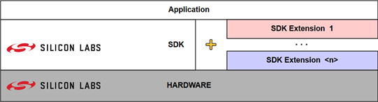

# Simplicity Extensions

This docSpace provides a guideline and examples to build a third-party SDK extension for Silicon Labs SDKs. 

An SDK (Software Development Kit) is a comprehensive software package that provides developers with the necessary tools, libraries, and resources to build applications for Silicon Labs' hardware platforms. 

SDK extensions are specialized additions to the main Software Development Kits (SDK) that provide additional functionality or components for specific development needs.

SDKs and SDK extensions are composed of components, which are defined following the Silicon Labs Configurator (SLC) Specification.

Silicon Labs Configurator (SLC) is a metadata specification for Silicon Labs SDKs. It also describes methods of creating and configuring embedded software projects for Silicon Labs IoT devices using this metadata.

- [Getting Started with SDK Extensions](EXTENSION.md)
- [Getting Started with External Repos](EXTERNAL_REPO.md)
